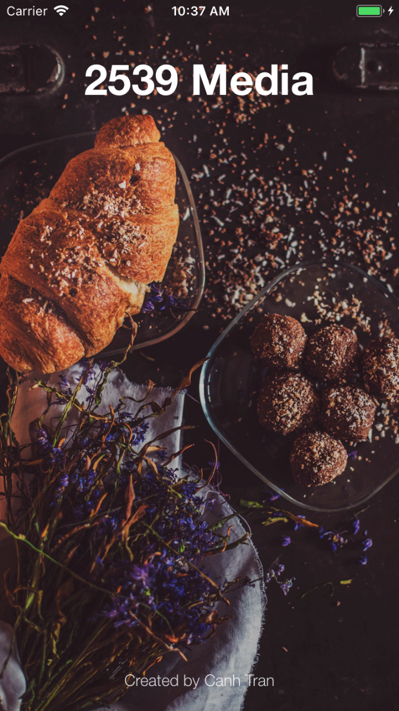
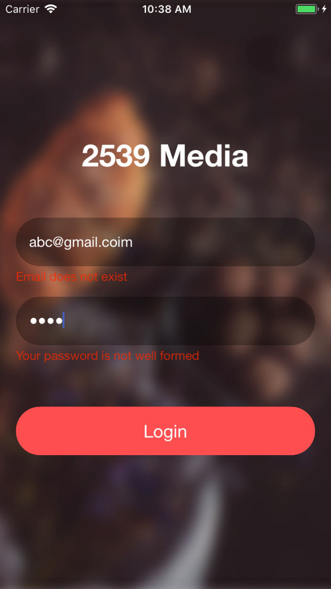
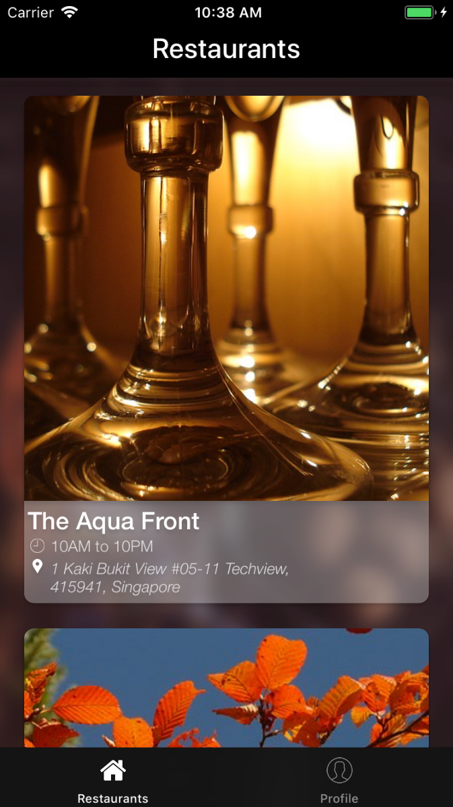

# 2539RestaurantListingApp
2539 iOS Take Home Test

### Requirement: We are going to create a simple restaurant listing app that consists of a login screen and a restaurant listing screen. On successful login, user will be directed to the restaurant listing screen. All data will be hard-coded as no API request is necessary.

## Notes: 
 - This project using MVVM pattern, reactive programing (RxSwift) and my library CT_RESTAPI (Decoable Swift 4/ObjectMapper)
 - Including UITests for Login (not for UNitTests for this requirement)
 - There is no need to install Pods (I commited all already)

### Images:

<p align="center">
  
</p>

<p align="center">
  
</p>

<p align="center">
  
</p>


#### Correct account for Login
 ```
 takehome@2359media.com 
 1Faraday@
 ```
